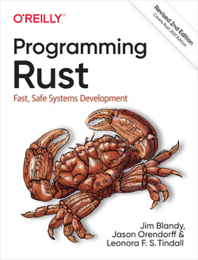

# Plan

- Introduction
- Check-in
- Kahoot
- Organizational info
- Tools set-up
- Gitlab
- Submit-00
- Check-out?

---

# <!--fit--> PV281: Programování v Rustu

---

# <!--fit--> Introduction 

---

# <!--fit--> Check-IN

---

# <!--fit--> Kahoot 

---

# Organizational info 

[Interactive syllabus](https://is.muni.cz/auth/el/fi/podzim2023/PV281/index.qwarp)
[Personal materials](courses.dungeon.software)

---

# Recommendations

[The book](https://doc.rust-lang.org/book/)

---

# Recommendations

[Programming Rust](https://www.oreilly.com/library/view/programming-rust-2nd/9781492052586/)

---

# Recommendations

[Zero to Production Rust](https://www.zero2prod.com/index.html?country=Czech%20Republic&discount_code=EEU60)

---

# Recommendations

[Lets get Rusty](https://www.youtube.com/c/LetsGetRusty)
[No boilerplate](https://www.youtube.com/@NoBoilerplate)

---

# Tools 

- VS Code + [VS Code rust-anaylizer](https://marketplace.visualstudio.com/items?itemName=rust-lang.rust-analyzer)
- JetBrains [Rust Rover](https://www.jetbrains.com/rust/)

RIP [JetBrains Rust Plugin](https://plugins.jetbrains.com/plugin/8182--deprecated-rust)

---

# Rust 

[Rust-lang](https://www.rust-lang.org)

---

# Iterations

[Repository](https://gitlab.fi.muni.cz/pv281/pv281-iterations-2023)
[Guide](https://is.muni.cz/auth/el/fi/podzim2023/PV281/index.qwarp?prejit=11388609)
[Conventional Commits](https://www.conventionalcommits.org/en/v1.0.0/)

---

# Coding time

---

# <!--fit--> Check-OUT

---

# That's it for today 

