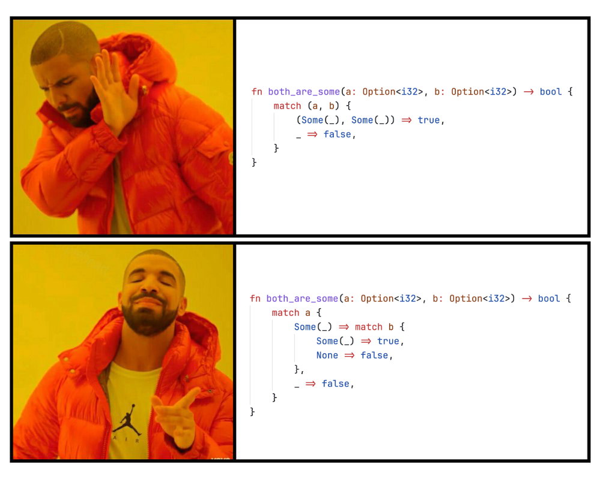

# Plan

- Check-in
- Code reviews
- Kahoot
- Smokers 
- Check-out

---

# <!--fit--> PV281: Programování v Rustu

---

# <!--fit--> Check-IN

---

# <!--fit--> Code reviews

---

---

---

---

---

---

# <!--fit--> Kahoot 

---

# Coding time

[Seminar 07 Repo](https://gitlab.fi.muni.cz/pv281/seminar-exercises/week-07-redis)

---

# <!--fit--> Check-OUT

---

# That's it for today 

